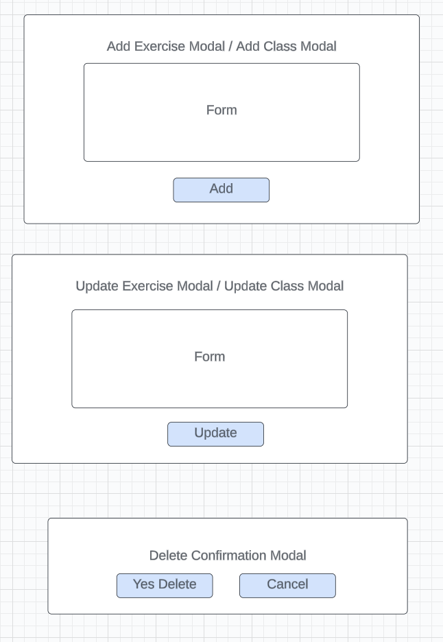
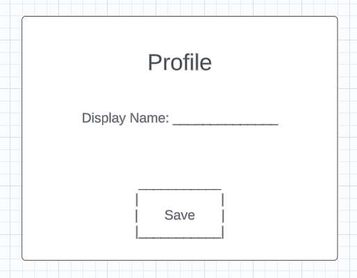

# Health Hub

**Health Hub** will help you with your health and fitness goals - let you plan your days by adding classes or exercises that focus on strength, cardio, core, or recovery training!  You'll also be able to add goals to march towards to help you stay focused on your "better you" journey!

It is a MERN Stack client application, built with React and Node.js and interacts with the [Health API](https://github.com/BeccaK8/health-api) (built with MongoDB/Mongoose and Express.js)

URL: https://myhealthhub.netlify.app/

## User Stories

### User Authentication

- AAV, I want to sign up for Health Hub
- AAU, I want to sign into my account with Health Hub
- AAU, I want to change my password
- AAU, I want to sign out of my account

### User Profile

- AAU, I want to see my user profile
- AAU, I want to update my user profile

### Health Date

Note: A user will not have a health date created for a specific date until they begin to plan healthy activities for that day.

- AAU, I want to navigate through the dates on a calendar and see the health plan associated with that date, if it exists
- AAU, I want to get a specific date and all the information associated with it
- AAU, I want to create a new date that I can associate health plans with
- AAU, I want to update the focus area and personal statement for a particular date
- AAU, I want to delete everything associated with a health date in case I decide to forget that whole plan

### Fitness Plans

- AAU, I want to add a class that I plan on going to on a particular date
- AAU, I want to add an exercise that I plan on doing on a particular date
- AAU, I want to change a class I have planned for a particular date
- AAU, I want to change an exercise I have planned for a particular date
- AAU, I want to remove a class I have planned for a particular date
- AAU, I want to remove an exercise I have planned for a particular date

Trello board for managing client application user stories:

## Wireframes

Main "Show" page with navigation bar and calendar navigation

Modals to Add, Update, and Delete Exercise and Class Fitness Plans

User Profile Screen

Personal Fitness Goals Index Page

## Technologies Used

- MERN Stack - Client 
- React
- Node.js
- Token Authentication
- CSS, Bootstrap

## Next Steps / Ice Box

Coming soon...
