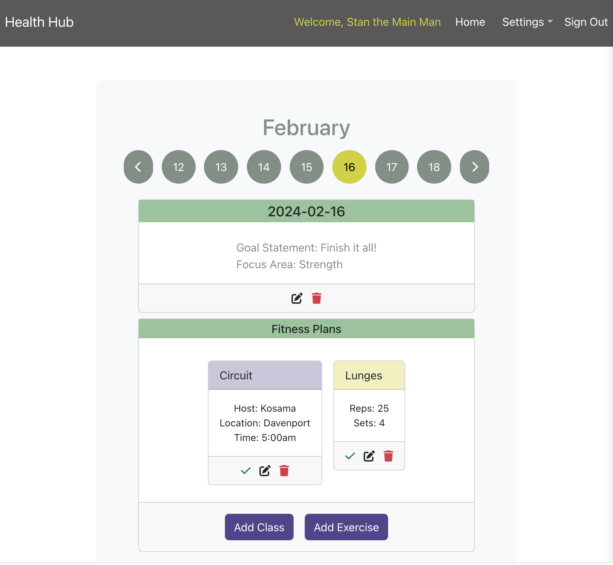
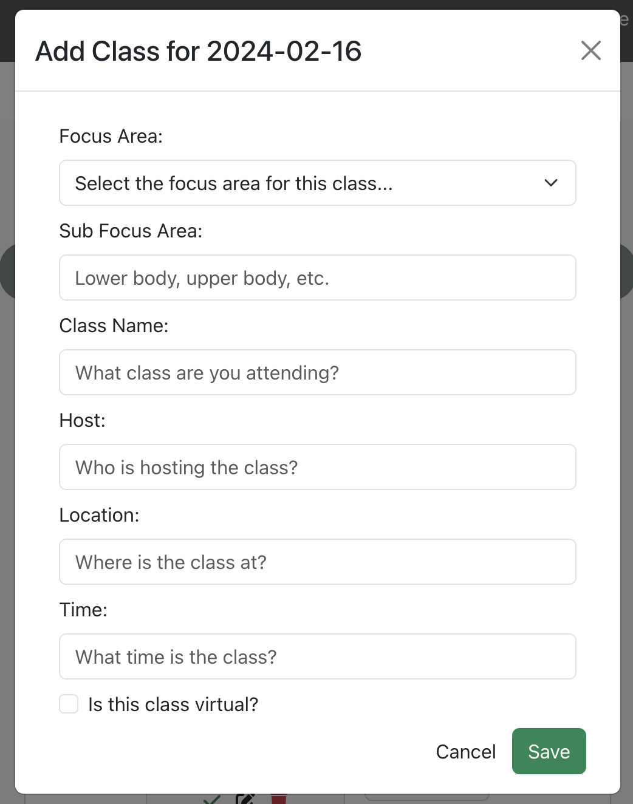
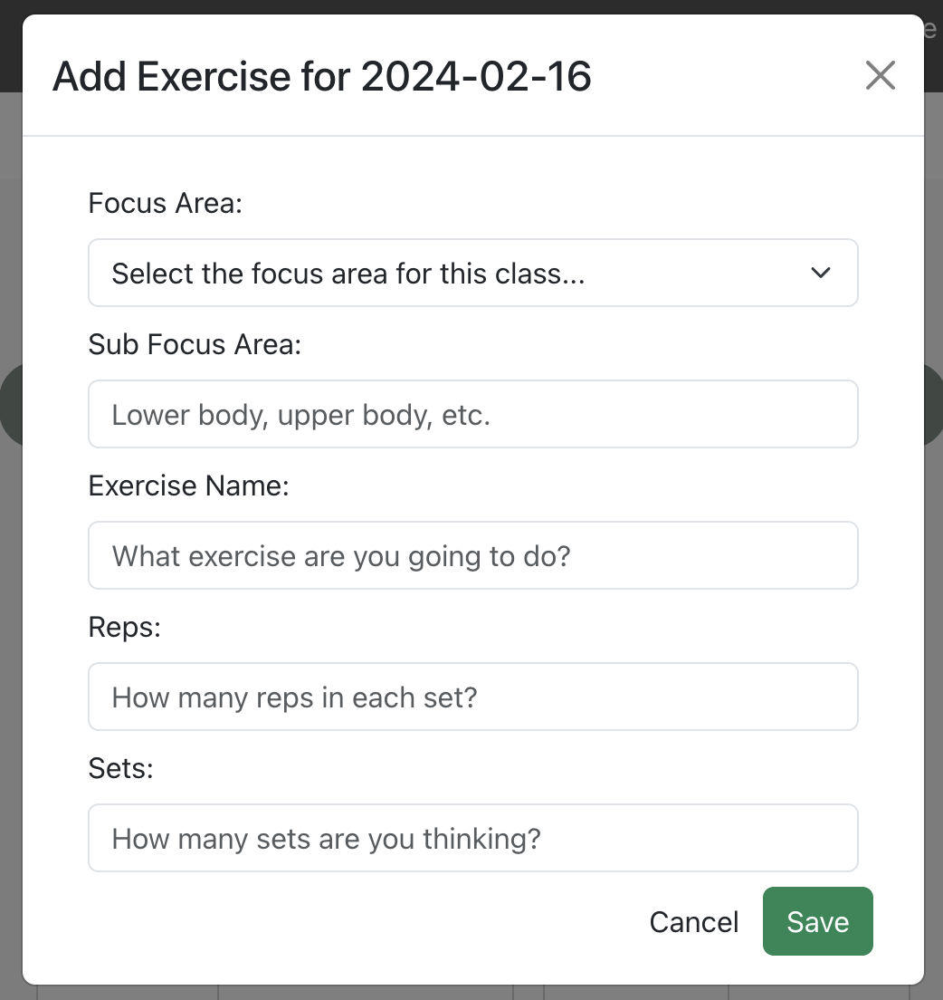
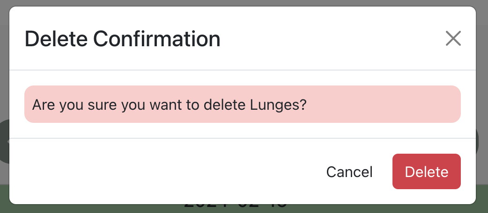
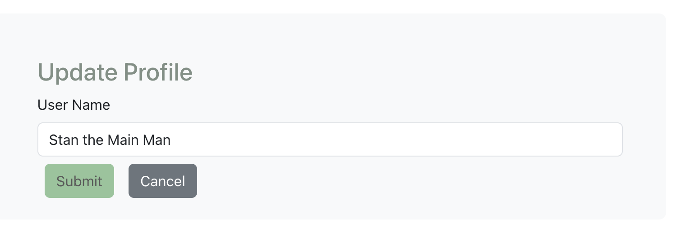

# Health Hub

**Health Hub** will help you with your health and fitness goals - let you plan your days by adding classes or exercises that focus on strength, cardio, core, or recovery training!  You'll also be able to add goals to march towards to help you stay focused on your "better you" journey!

It is a MERN Stack client application, built with React and Node.js and interacts with the [Health API](https://github.com/BeccaK8/health-api) (built with MongoDB/Mongoose and Express.js)

## Getting Started

Client URL: https://myhealthhub.netlify.app/

API URL: https://health-api-rlk.fly.dev

## User Stories

### User Authentication

- AAV, I want to sign up for Health Hub
- AAU, I want to sign into my account with Health Hub
- AAU, I want to change my password
- AAU, I want to sign out of my account

### User Profile

- AAU, I want to see my user profile
- AAU, I want to update my user profile

### Health Date

Note: A user will not have a health date created for a specific date until they begin to plan healthy activities for that day.

- AAU, I want to navigate through the dates on a calendar and see the health plan associated with that date, if it exists
- AAU, I want to get a specific date and all the information associated with it
- AAU, I want to create a new date that I can associate health plans with
- AAU, I want to update the focus area and personal statement for a particular date
- AAU, I want to delete everything associated with a health date in case I decide to forget that whole plan

### Fitness Plans

- AAU, I want to add a class that I plan on going to on a particular date
- AAU, I want to add an exercise that I plan on doing on a particular date
- AAU, I want to change a class I have planned for a particular date
- AAU, I want to change an exercise I have planned for a particular date
- AAU, I want to remove a class I have planned for a particular date
- AAU, I want to remove an exercise I have planned for a particular date
- AAU, I want to mark a class as completed
- AAU, I want to mark a class as not completed
- AAU, I want to mark an exercise as completed
- AAU, I want to mark an exercise as not completed

## Screenshots and Wireframes

Main "Show" page with navigation bar and calendar navigation

Modals to Add, Update, and Delete Exercise and Class Fitness Plans

User Profile Screen

Personal Fitness Goals Index Page (Coming Soon!)

## Technologies Used

- MERN Stack - Client 
- React
- Node.js
- Token Authentication
- CSS, Bootstrap, React Bootstrap, Sass

## Next Steps / Ice Box

- AAU, I want to set goals for myself and track completion towards those on a daily basis
- AAU, I want to see metrics of my completed vs uncompleted focus plans
- AAU, I want to track health plans like water and diet
- AAU, I want to track mental stimulation plans like reading or puzzles
- AAU, I want to pick from a master list of exercises
- AAU, I want to save my favorites exercises to pick from
- AAU, I want to pick from a master list of classes
- AAU, I want to save my favorites classes to pick from
- AAU, I want to see a schedule of my time-based classes
